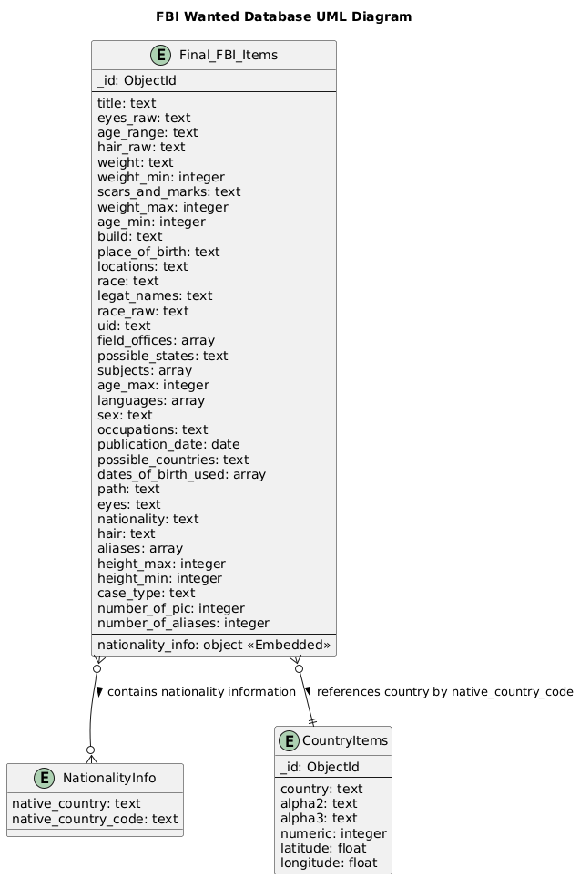
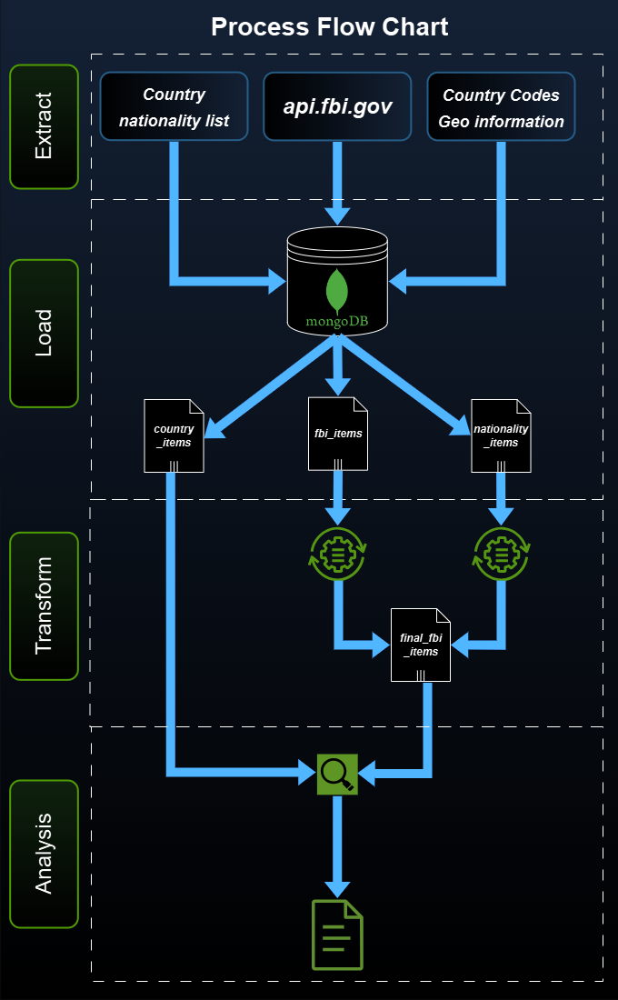

<!-- PROJECT LOGO -->
 

  

# CrimeData-PyMongo – Focuses on crime data processing using Python and MongoDB

<!-- TABLE OF CONTENTS -->
<li><a href="#about-the-project">About The Project</a></li>
<li><a href="#Process Workflow">Process Workflow</a></li>
<li><a href="#data-sources">Data Sources</a></li>

# About The Project
The Federal Bureau of Investigation (FBI) regularly updates and publishes a list of individuals wanted in connection with various crimes or unsolved cases. This project aims to analyze the FBI wanted list in depth, with a specific focus on identifying patterns in crime categories and extracting meaningful insights from publicly available data. Key areas of investigation include demographic and geographic characteristics of wanted individuals, as well as a detailed review of crime categories such as terrorism, cybercrime, and counterintelligence.

# Process Workflow
The analysis is based on structured data processing techniques, leveraging MongoDB's aggregation framework to clean, transform, and merge multiple data sources for a comprehensive understanding. A variety of data transformation and visualization techniques were applied throughout the analysis. The primary steps in data processing include:

**Extracting & Loading Data:** Relevant FBI wanted data is collected via API and stored in a MongoDB database.

**Data Cleaning & Transformation:**

- Identifying missing values

- Standardizing case categories

- Merging additional datasets for enhanced geographic context

**Aggregation & Analysis:**

- Grouping cases based on crime type

- Enriching raw data with nationality and country-of-origin information

- Visualizing trends through interactive charts and maps

The resulting database structure, stored in MongoDB, can be visualized as the following UML-diagram:

The primary source for this analysis is the FBI Most Wanted database, complemented by nationality information and geospatial country data to provide a comprehensive view of international crime trends. The overall process can therefore be summarized as follows:

# Data Sources
The data used for this project is publicly available via the following links:
[FBI-cases](https://api.fbi.gov/wanted/v1/list?)
[Country-nationality-list](https://raw.githubusercontent.com/Imagin-io/country-nationality-list/refs/heads/master/countries.json)
[Country-codes-lat-lon](https://raw.githubusercontent.com/eesur/country-codes-lat-long/refs/heads/master/country-codes-lat-long-alpha3.json)

Furthermore, the following information is helpful to form a general understanding of MongoDB:
[MongoDB-in-Python](https://app.datacamp.com/learn/courses/introduction-to-using-mongodb-for-data-science-with-python)
[MongoDB-manual](https://www.mongodb.com/docs/manual/)